# Bank Management System (BMS) 

### Programming Fundamentals  --  Semester Project Documentation
---
### Project Details

| Field | Details |
|---|---|
| **Project Title** | Bank Management System (BMS) |
| **Language** | C++ |
| **Platform** | Windows Console Application |
| **Compiler** | MinGW GCC 6.3.0+ |
| **IDE** | Visual Studio Code |
| **Team-Size** | Solo |

---

## Table of Contents

| Section | Title |
|:---:|---|
| 01 | [Introduction](#1-introduction)  |
| 02 | [Problem Statement](#2-problem-statement) |
| 03 | [Objectives](#3-objectives) |
| 04 | [System Requirements](#4-system-requirements) |
| 05 | [Project File Structure](#5-project-file-structure)  |
| 06 | [System Architecture](#6-system-architecture)  |
| 07 | [Data Structures](#7-data-structures)  |
| 08 | [Module Breakdown](#8-module-breakdown)  |
| 09 | [Detailed Feature Specifications](#9-detailed-feature-specifications)  |
| 10 | [System Flowcharts](#10-system-flowcharts)  |
| 11 | [File Format Specifications](#11-file-format-specifications)  |
| 12 | [Complete Function Reference](#12-complete-function-reference)  |
| 13 | [Security Design](#13-security-design)  |
| 14 | [User Interface Guide](#14-user-interface-guide)  |
| 15 | [Compilation and Execution](#15-compilation-and-execution)  |
| 16 | [Testing Plan](#16-testing-plan)  |
| 17 | [Limitations and Future Enhancements](#17-limitations-and-future-enhancements)  |
| 18 | [Conclusion](#18-conclusion)  |

---


## 1. Introduction

The **Bank Management System (BMS)** is a comprehensive console-based banking application built entirely in C++. It simulates real-world banking operations by providing three distinct user interfaces    **Admin**, **Customer**, and **ATM**    each with role-specific functionality.

The system manages customer accounts, processes financial transactions (deposits, withdrawals, transfers), enforces security through password and PIN authentication, and persists all data using pipe-delimited flat files. A distinctive feature is the **automatic Zakat deduction** mechanism, which calculates and deducts 2.5% from accounts exceeding the PKR 3,000,000 nisab threshold.

The application follows a **modular architecture**, separating concerns across dedicated header and implementation files, making the codebase maintainable, readable, and extensible.

---

## 2. Problem Statement

Traditional banking operations require a structured system to manage customer data, process financial transactions, and maintain security. In an educational context, there is a need for a project that demonstrates:

- Modular programming with multiple source files
- Struct-based data modeling (without classes)
- File I/O for persistent storage
- Array-based data management with search algorithms
- Input validation and error handling
- Role-based access control
- Real-world business logic (Zakat calculation)

This project addresses all of the above by implementing a fully functional banking simulation.

---

## 3. Objectives

| # | Objective | Status |
|---|---|---|
| 1 | Implement multi-module C++ project architecture | Done |
| 2 | Provide Admin dashboard with full CRUD on customer accounts | Done |
| 3 | Enable customer self-registration and secure login | Done |
| 4 | Support Deposit, Withdrawal, and Transfer operations | Done |
| 5 | Implement ATM simulation with PIN-based authentication | Done |
| 6 | Persist all data to text files with structured formatting | Done |
| 7 | Enforce input validation (passwords, PINs, amounts) | Done |
| 8 | Implement account locking after failed login attempts | Done |
| 9 | Auto-calculate and deduct Zakat on eligible accounts | Done |
| 10 | Generate transaction receipts and system statistics | Done |

---

## 4. System Requirements

### Hardware Requirements

| Component | Minimum |
|---|---|
| Processor | Intel/AMD x86 or x64 |
| RAM | 256 MB |
| Disk Space | 10 MB |
| Display | Standard console terminal |

### Software Requirements

| Component | Specification |
|---|---|
| Operating System | Windows 7 / 8 / 10 / 11 |
| Compiler | MinGW GCC 6.3.0 or higher |
| Libraries | `<iostream>`, `<fstream>`, `<sstream>`, `<iomanip>`, `<ctime>`, `<cstdlib>`, `<conio.h>`, `<windows.h>` |

> [!NOTE]
> This project uses `<windows.h>` for console color output and `<conio.h>` for masked input. These are Windows-specific and the project will not compile on Linux/macOS without modification.

---

## 5. Project File Structure

```
-PF Project BMS/
│
├── main.cpp                    # Program entry point and main menu
│
├── headers/                    # Header files (declarations)
│   ├── structs.h               # Customer and Transaction structs
│   ├── globals.h               # Constants and configuration values
│   ├── utils.h                 # Utility function declarations
│   ├── filehandling.h          # File I/O function declarations
│   ├── admin.h                 # Admin module declarations
│   ├── customer.h              # Customer module declarations
│   └── atm.h                   # ATM module declarations
│
├── modules/                    # Implementation files (definitions)
│   ├── utils.cpp               # Screen, color, validation, animation logic
│   ├── filehandling.cpp        # File read/write/search operations
│   ├── admin.cpp               # Admin login, CRUD, banking, reports
│   ├── customer.cpp            # Registration, login, banking operations
│   └── atm.cpp                 # ATM PIN login, cash ops, mini statement
│
├── customers.txt               # Customer data file (auto-generated)
├── transactions.txt            # Transaction log file (auto-generated)
└── bms.exe                     # Compiled executable
```

The following diagram illustrates the dependency relationships between files:

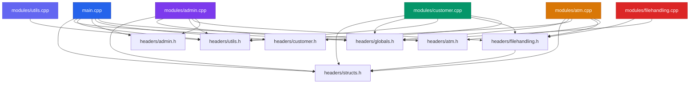

---

## 6. System Architecture

The BMS follows a **layered modular architecture** with clear separation between the user interface layer, business logic layer, and data persistence layer.

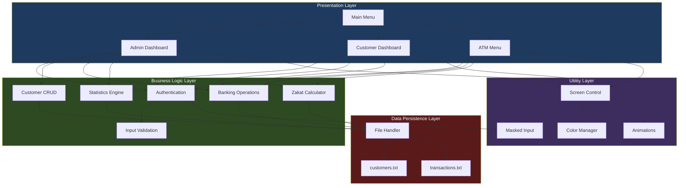

### Architecture Principles

| Principle | Implementation |
|---|---|
| **Modularity** | Each feature area is in its own `.h` / `.cpp` pair |
| **Separation of Concerns** | UI, logic, and data layers are independent |
| **Single Responsibility** | Each function performs exactly one task |
| **DRY (Don't Repeat Yourself)** | Shared utilities (colors, validation) used across all modules |
| **Data Encapsulation** | All file access goes through `filehandling.cpp` |

---

## 7. Data Structures

The system uses two core structs to model all data. No classes are used    this is a procedural C++ project appropriate for a Programming Fundamentals course.

### 7.1 Customer Struct

```cpp
struct Customer {
    int accountNumber;      // Auto-generated unique ID (starts at 1001)
    string name;            // Full name of the account holder
    string cnic;            // National ID (unique per customer)
    string phone;           // Contact number
    string address;         // Residential address
    string password;        // Login password (validated: 8+ chars, mixed)
    int pin;                // 4-digit ATM PIN (1000–9999)
    double balance;         // Current account balance in PKR
    string accountType;     // "Savings" or "Current"
    bool isLocked;          // true = account frozen
};
```

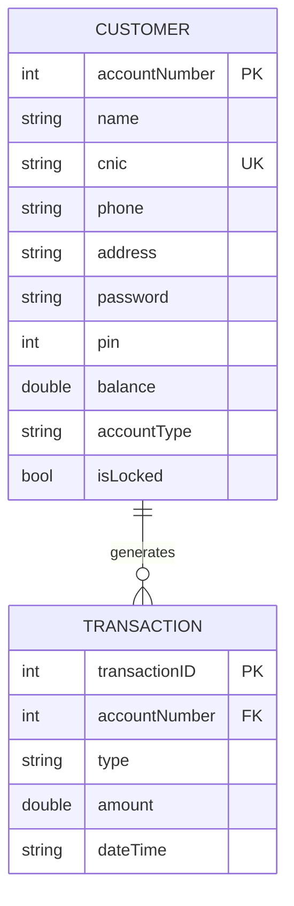

### 7.2 Transaction Struct

```cpp
struct Transaction {
    int transactionID;      // Auto-generated unique ID (starts at 10001)
    int accountNumber;      // The account this transaction belongs to
    string type;            // Transaction category (see table below)
    double amount;          // Transaction amount in PKR
    string dateTime;        // Timestamp: "YYYY-MM-DD HH:MM:SS"
};
```

### 7.3 Transaction Types

| Type String | Description | Triggered By |
|---|---|---|
| `Deposit` | Money added to account | Admin / Customer |
| `Withdrawal` | Money removed from account | Admin / Customer |
| `Transfer-Out` | Money sent to another account | Admin / Customer |
| `Transfer-In` | Money received from another account | Admin / Customer |
| `ATM-Withdrawal` | Cash withdrawn via ATM | ATM |
| `ATM-FastCash` | Preset amount withdrawn via ATM | ATM |
| `Zakat-Deduction` | 2.5% auto-deducted when balance > 3M | System (automatic) |

### 7.4 Global Constants

| Constant | Value | Purpose |
|---|---|---|
| `ADMIN_USERNAME` | `"admin"` | Hardcoded admin login |
| `ADMIN_PASSWORD` | `"Admin@123"` | Hardcoded admin password |
| `MAX_LOGIN_ATTEMPTS` | `3` | Failed attempts before lockout |
| `MAX_CUSTOMERS` | `100` | Maximum customer array size |
| `MAX_TRANSACTIONS` | `1000` | Maximum transaction array size |
| `CUSTOMERS_FILE` | `"customers.txt"` | Customer data file path |
| `TRANSACTIONS_FILE` | `"transactions.txt"` | Transaction log file path |

---

## 8. Module Breakdown

### 8.1 Main Module    `main.cpp`

The entry point of the application. Responsible for:

- Displaying the loading screen animation on startup
- Rendering the ASCII art bank logo
- Presenting the main menu with three routing options
- Handling invalid input gracefully

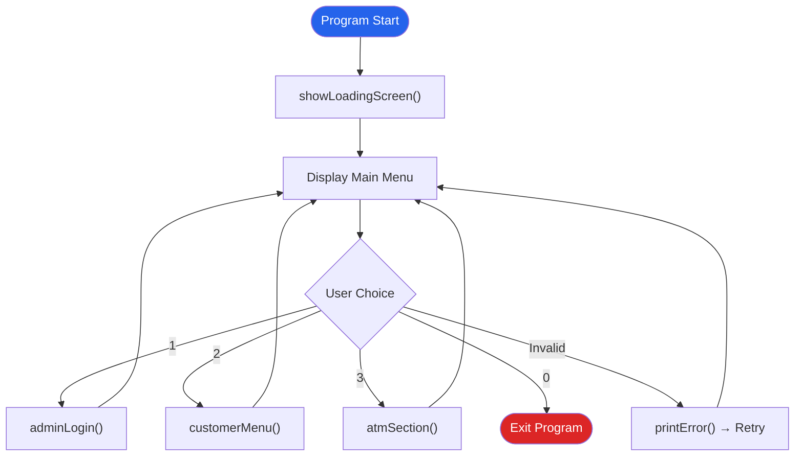

---

### 8.2 Admin Module    `admin.cpp`

The most feature-rich module. Provides the bank manager with full control over the system.

**Authentication:** Single hardcoded admin account with masked password input.

**Features (12 operations):**

| # | Feature | Function | Description |
|---|---|---|---|
| 1 | Add Customer | `addCustomer()` | Create account with auto-generated number, validated password/PIN |
| 2 | View All Customers | `viewAllCustomers()` | Tabular display of all accounts |
| 3 | Search Customer | `searchCustomer()` | Find by account number or CNIC |
| 4 | Edit Customer | `editCustomer()` | Modify phone, address, password, or PIN |
| 5 | Delete Customer | `deleteCustomer()` | Permanent removal with confirmation prompt |
| 6 | Deposit | `adminDeposit()` | Add funds with receipt and transaction log |
| 7 | Withdraw | `adminWithdraw()` | Remove funds with balance validation |
| 8 | Transfer | `adminTransfer()` | Move funds between two accounts |
| 9 | Transaction History | `viewAllTransactions()` | View all transactions in tabular format |
| 10 | Statistics | `showStatistics()` | Summary report of entire system |
| 11 | Lock Account | `adminLockAccount()` | Freeze an account with confirmation |
| 12 | Unlock Account | `adminUnlockAccount()` | Restore a locked account |

---

### 8.3 Customer Module    `customer.cpp`

Handles customer self-service operations with secure authentication.

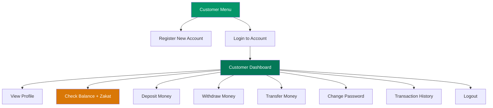

| # | Feature | Function | Key Logic |
|---|---|---|---|
| 1 | Registration | `registerCustomer()` | Duplicate CNIC check, password/PIN validation |
| 2 | Login | `loginCustomer()` | 3-attempt limit, auto-lock on failure |
| 3 | View Profile | `viewProfile()` | Read-only display of all account fields |
| 4 | Check Balance | `checkBalance()` | Triggers Zakat deduction if eligible |
| 5 | Deposit | `customerDeposit()` | Amount validation, receipt generation |
| 6 | Withdraw | `customerWithdraw()` | Insufficient balance check |
| 7 | Transfer | `customerTransfer()` | Self-transfer prevention, receiver lock check |
| 8 | Change Password | `changePassword()` | Current password verification, confirmation |
| 9 | Transaction History | `viewMyTransactions()` | Filtered by account number |

---

### 8.4 ATM Module    `atm.cpp`

Simulates a real ATM experience with PIN-based authentication and preset operations.

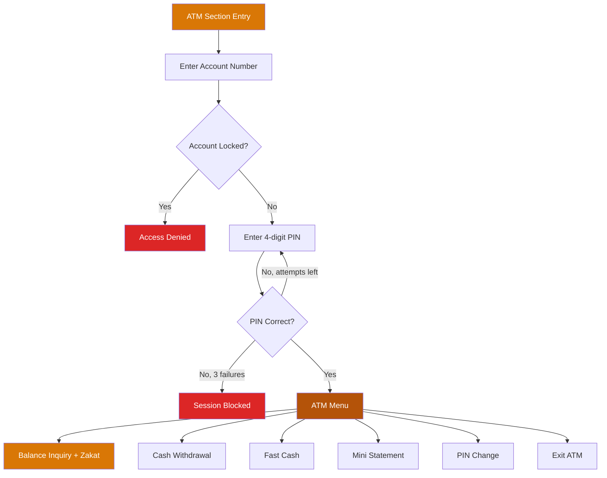

| # | Feature | Function | Key Logic |
|---|---|---|---|
| 1 | Balance Inquiry | `balanceInquiry()` | Triggers Zakat deduction if eligible |
| 2 | Cash Withdrawal | `cashWithdrawal()` | Custom amount with balance check |
| 3 | Fast Cash | `fastCash()` | Preset amounts: 500, 1000, 5000, 10000 |
| 4 | Mini Statement | `miniStatement()` | Last 5 transactions for the account |
| 5 | PIN Change | `changePin()` | Current PIN verification, confirmation |

---

### 8.5 File Handling Module    `filehandling.cpp`

The data persistence layer. All file I/O is centralized here    no other module directly reads or writes files.

| Function | Operation | Description |
|---|---|---|
| `saveCustomer()` | Append | Writes one customer record to end of file |
| `saveAllCustomers()` | Overwrite | Rewrites entire file (used after edits/deletes) |
| `loadAllCustomers()` | Read | Parses all customers into an array, returns count |
| `saveTransaction()` | Append | Writes one transaction record to end of file |
| `loadAllTransactions()` | Read | Parses all transactions into an array, returns count |
| `getNextAccountNumber()` | Read | Scans file for highest account number + 1 |
| `getNextTransactionID()` | Read | Scans file for highest transaction ID + 1 |
| `findCustomerIndex()` | Search | Linear search by account number, returns index or -1 |
| `findCustomerByCNIC()` | Search | Linear search by CNIC string, returns index or -1 |

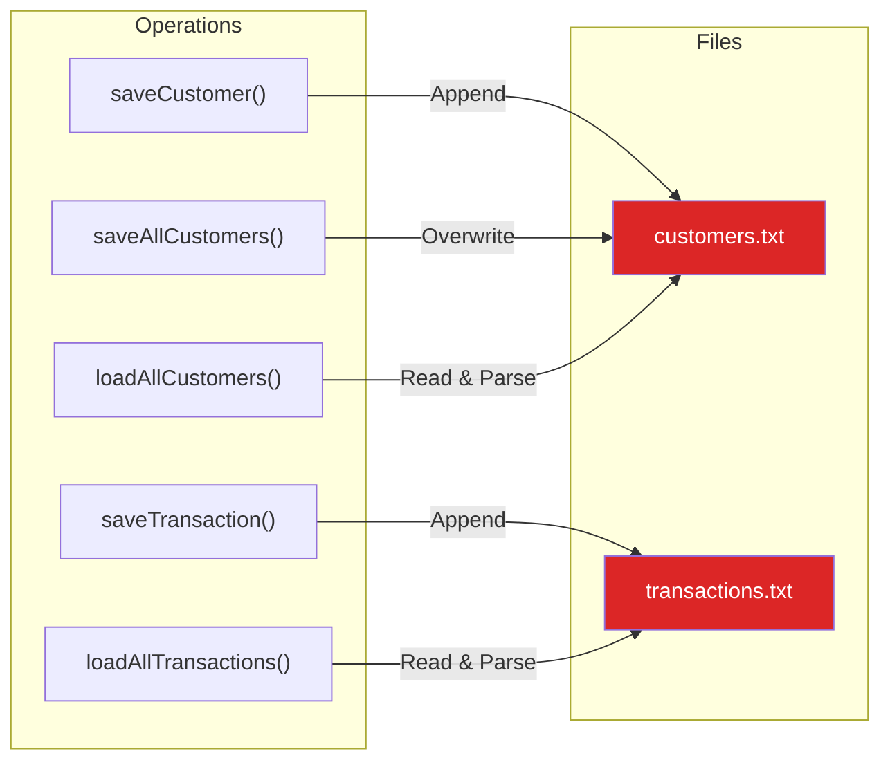

---

### 8.6 Utilities Module    `utils.cpp`

Provides shared helper functions used by every other module.

| Category | Functions | Purpose |
|---|---|---|
| **Screen Control** | `clearScreen()`, `pressEnterToContinue()`, `printHeader()`, `printBankLogo()`, `printLine()` | Console display management |
| **Date/Time** | `getCurrentDateTime()` | Returns formatted timestamp `YYYY-MM-DD HH:MM:SS` |
| **Validation** | `validatePassword()`, `validatePIN()` | Enforces password and PIN rules |
| **Masked Input** | `maskPasswordInput()`, `maskPINInput()` | Displays `*` instead of actual characters |
| **Colors** | `setColor()`, `resetColor()`, `printSuccess()`, `printError()`, `printWarning()` | Windows console color output |
| **Animations** | `showLoadingScreen()`, `showProcessing()`, `printReceipt()` | Visual feedback and receipts |

---

## 9. Detailed Feature Specifications

### 9.1 Customer Registration Flow

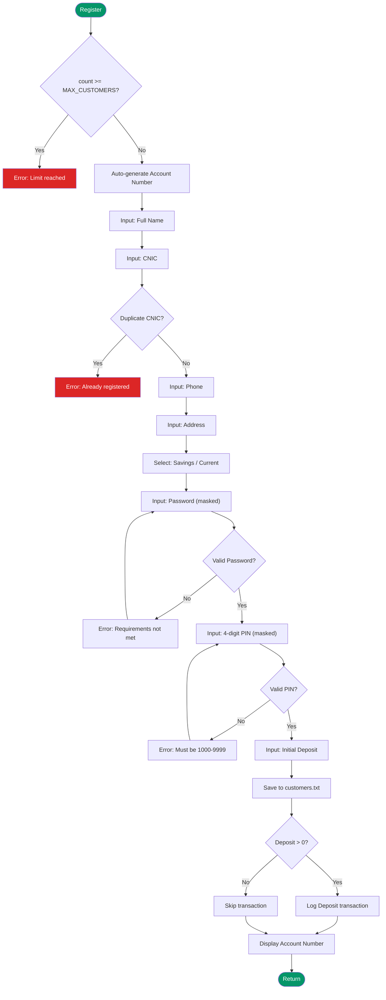

**Password Validation Rules:**
- Minimum 8 characters
- At least 1 uppercase letter (A–Z)
- At least 1 lowercase letter (a–z)
- At least 1 digit (0–9)
- At least 1 special character

**PIN Validation Rules:**
- Exactly 4 digits
- Range: 1000–9999

---

### 9.2 Customer Login and Account Locking

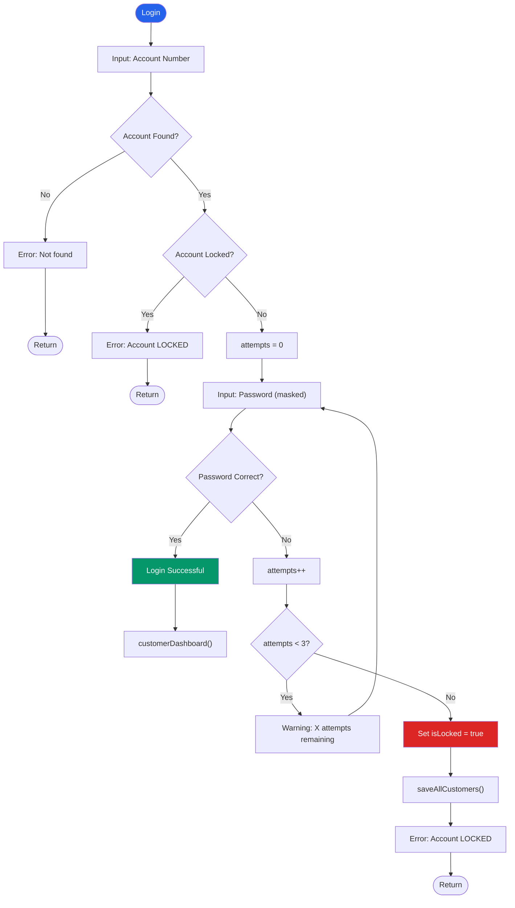

---

### 9.3 Money Transfer Flow

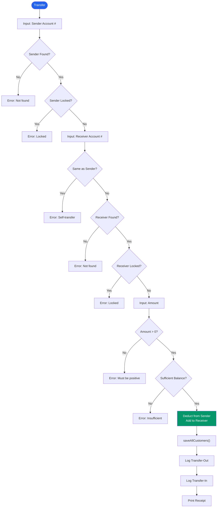

---

### 9.4 Zakat Auto-Deduction Feature

This is a unique feature of the BMS. When a customer checks their account balance (via Customer Dashboard or ATM), the system automatically evaluates Zakat eligibility.

**Business Rules:**

| Rule | Value |
|---|---|
| Nisab Threshold | PKR 3,000,000 |
| Zakat Rate | 2.5% |
| Deduction Frequency | Once per account (tracked via transaction history) |
| Applies To | Customer Balance Check and ATM Balance Inquiry |

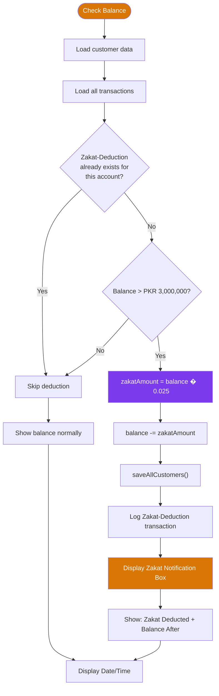

**Example Calculation:**

| Field | Value |
|---|---|
| Original Balance | PKR 3,500,000.00 |
| Zakat Rate | 2.5% |
| Zakat Amount | PKR 87,500.00 |
| Balance After Deduction | PKR 3,412,500.00 |

**On-screen Notification:**

```
  +-------------------------------------------------+
  |              ZAKAT NOTIFICATION                  |
  +-------------------------------------------------+
  |  Zakat of 2.5% has been deducted from your      |
  |  account and transferred to the zakat fund.     |
  +-------------------------------------------------+

  Zakat Deducted  : PKR 87500.00
  Balance After   : PKR 3412500.00
```

---

### 9.5 ATM Fast Cash

Provides preset withdrawal amounts for quick transactions, simulating a real ATM experience.

| Option | Amount (PKR) |
|---|---|
| 1 | 500 |
| 2 | 1,000 |
| 3 | 5,000 |
| 4 | 10,000 |
| 0 | Cancel |

---

### 9.6 System Statistics Report

The admin can generate a summary report showing:

- Total number of customers
- Breakdown: Savings vs Current accounts
- Active vs Locked accounts
- Total bank balance (sum of all customer balances)
- Total number of transactions
- Report generation timestamp

---

## 10. System Flowcharts

### 10.1 Complete System Flow

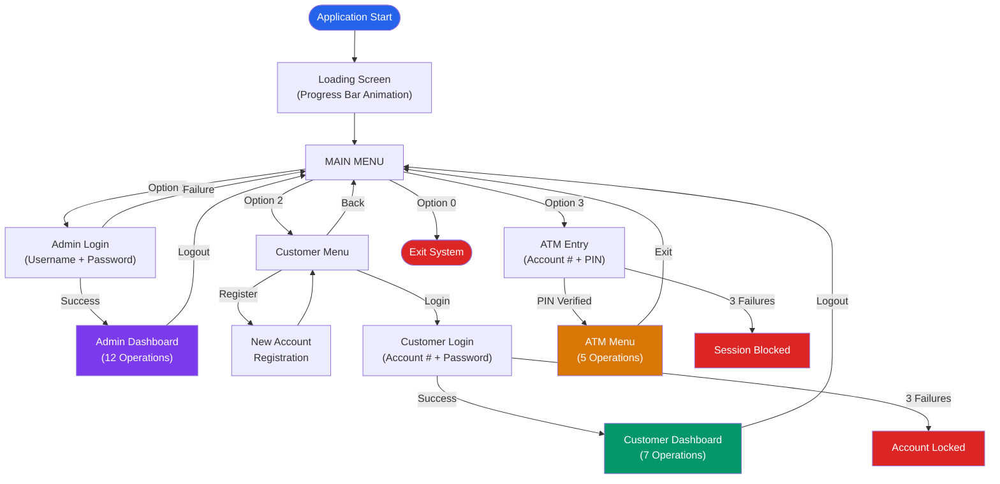

### 10.2 Data Flow Overview

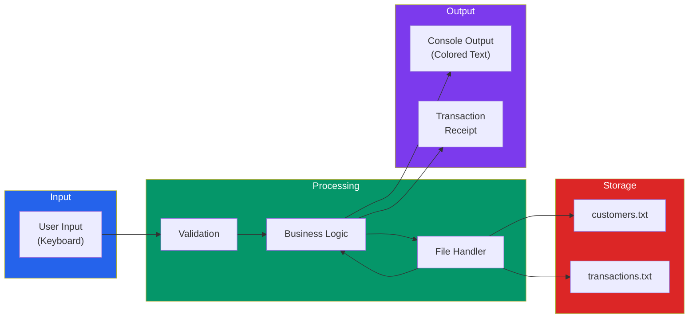

---

## 11. File Format Specifications

### 11.1 customers.txt

Each line represents one customer record. Fields are separated by the pipe `|` delimiter.

**Format:**
```
accountNumber|name|cnic|phone|address|password|pin|balance|accountType|isLocked
```

**Example:**
```
1001|Ahmed Ali|35201-1234567-1|0300-1234567|Lahore|Ahmed@123|1234|3500000.00|Savings|0
1002|Sara Khan|35202-7654321-2|0321-7654321|Karachi|Sara@4567|5678|150000.50|Current|0
1003|Usman Tariq|35203-1112233-3|0333-1112233|Islamabad|Usman@789|9012|5000000.00|Savings|1
```

| Field | Type | Notes |
|---|---|---|
| accountNumber | int | Auto-generated, starts at 1001 |
| name | string | Full name, may contain spaces |
| cnic | string | Format: XXXXX-XXXXXXX-X |
| phone | string | Contact number |
| address | string | May contain spaces |
| password | string | Validated on creation |
| pin | int | 4-digit ATM PIN (1000–9999) |
| balance | double | Two decimal places |
| accountType | string | "Savings" or "Current" |
| isLocked | int | 0 = Active, 1 = Locked |

### 11.2 transactions.txt

Each line represents one transaction record.

**Format:**
```
transactionID|accountNumber|type|amount|dateTime
```

**Example:**
```
10001|1001|Deposit|3500000.00|2026-07-22 06:45:12
10002|1001|Zakat-Deduction|87500.00|2026-07-22 06:50:30
10003|1002|Transfer-Out|50000.00|2026-07-22 07:15:45
10004|1003|Transfer-In|50000.00|2026-07-22 07:15:45
```

---

## 12. Complete Function Reference

### 12.1 Main Module

| Function | Parameters | Return | Location |
|---|---|---|---|
| `main()` |    | `int` | main.cpp |

### 12.2 Admin Module

| Function | Parameters | Return | Description |
|---|---|---|---|
| `adminLogin()` |    | `void` | Authenticate admin with hardcoded credentials |
| `adminMenu()` |    | `void` | Display admin dashboard with 12 options |
| `addCustomer()` |    | `void` | Create new customer with full validation |
| `viewAllCustomers()` |    | `void` | Tabular listing of all accounts |
| `searchCustomer()` |    | `void` | Find customer by account number or CNIC |
| `editCustomer()` |    | `void` | Modify phone, address, password, or PIN |
| `deleteCustomer()` |    | `void` | Remove account with confirmation |
| `adminDeposit()` |    | `void` | Deposit into any account |
| `adminWithdraw()` |    | `void` | Withdraw from any account |
| `adminTransfer()` |    | `void` | Transfer between two accounts |
| `viewAllTransactions()` |    | `void` | Display all transactions system-wide |
| `showStatistics()` |    | `void` | Generate bank summary report |
| `adminLockAccount()` |    | `void` | Freeze a customer account |
| `adminUnlockAccount()` |    | `void` | Unfreeze a locked account |

### 12.3 Customer Module

| Function | Parameters | Return | Description |
|---|---|---|---|
| `customerMenu()` |    | `void` | Registration/Login selection |
| `registerCustomer()` |    | `void` | Self-service account creation |
| `loginCustomer()` |    | `void` | Authenticate with password (3 attempts) |
| `customerDashboard()` | `int accountNumber` | `void` | Logged-in customer's operation menu |
| `viewProfile()` | `int accountNumber` | `void` | Display all account information |
| `checkBalance()` | `int accountNumber` | `void` | Show balance + Zakat deduction if eligible |
| `customerDeposit()` | `int accountNumber` | `void` | Self-service deposit |
| `customerWithdraw()` | `int accountNumber` | `void` | Self-service withdrawal |
| `customerTransfer()` | `int accountNumber` | `void` | Send money to another account |
| `changePassword()` | `int accountNumber` | `void` | Update password with verification |
| `viewMyTransactions()` | `int accountNumber` | `void` | View own transaction history |

### 12.4 ATM Module

| Function | Parameters | Return | Description |
|---|---|---|---|
| `atmSection()` |    | `void` | ATM entry with PIN authentication |
| `atmMenu()` | `int accountNumber` | `void` | ATM operation selection menu |
| `balanceInquiry()` | `int accountNumber` | `void` | Show balance + Zakat deduction if eligible |
| `cashWithdrawal()` | `int accountNumber` | `void` | Custom amount ATM withdrawal |
| `fastCash()` | `int accountNumber` | `void` | Preset amount quick withdrawal |
| `miniStatement()` | `int accountNumber` | `void` | Last 5 transactions |
| `changePin()` | `int accountNumber` | `void` | Update ATM PIN with verification |

### 12.5 File Handling Module

| Function | Parameters | Return | Description |
|---|---|---|---|
| `saveCustomer()` | `Customer c` | `void` | Append one record to file |
| `saveAllCustomers()` | `Customer arr[], int count` | `void` | Overwrite file with array |
| `loadAllCustomers()` | `Customer arr[], int maxSize` | `int` | Parse file into array, return count |
| `saveTransaction()` | `Transaction t` | `void` | Append one record to file |
| `loadAllTransactions()` | `Transaction arr[], int maxSize` | `int` | Parse file into array, return count |
| `getNextAccountNumber()` |    | `int` | Scan for max + 1 (base: 1000) |
| `getNextTransactionID()` |    | `int` | Scan for max + 1 (base: 10000) |
| `findCustomerIndex()` | `Customer arr[], int count, int accountNumber` | `int` | Linear search, returns index or -1 |
| `findCustomerByCNIC()` | `Customer arr[], int count, string cnic` | `int` | Linear search, returns index or -1 |

### 12.6 Utilities Module

| Function | Parameters | Return | Description |
|---|---|---|---|
| `clearScreen()` |    | `void` | Calls `system("cls")` |
| `pressEnterToContinue()` |    | `void` | Waits for any key press |
| `printHeader()` | `string title` | `void` | Clears screen, draws centered title box |
| `printBankLogo()` |    | `void` | ASCII art bank logo |
| `printLine()` | `int length = 60` | `void` | Horizontal separator |
| `getCurrentDateTime()` |    | `string` | Returns `"YYYY-MM-DD HH:MM:SS"` |
| `validatePassword()` | `string password` | `bool` | Checks 8+ chars, mixed requirements |
| `validatePIN()` | `int pin` | `bool` | Checks range 1000–9999 |
| `maskPasswordInput()` |    | `string` | Reads chars, displays `*` |
| `maskPINInput()` |    | `int` | Reads 4 digits, displays `*` |
| `setColor()` | `int color` | `void` | Windows console color attribute |
| `resetColor()` |    | `void` | Reset to default white (7) |
| `printSuccess()` | `string msg` | `void` | Green `[SUCCESS]` message |
| `printError()` | `string msg` | `void` | Red `[ERROR]` message |
| `printWarning()` | `string msg` | `void` | Yellow `[WARNING]` message |
| `showLoadingScreen()` |    | `void` | Progress bar + module status |
| `showProcessing()` | `string msg` | `void` | Animated dots: `Processing...` |
| `printReceipt()` | `string type, int accNo, double amount, double newBalance` | `void` | Formatted transaction receipt box |

---

## 13. Security Design

### 13.1 Authentication Mechanisms

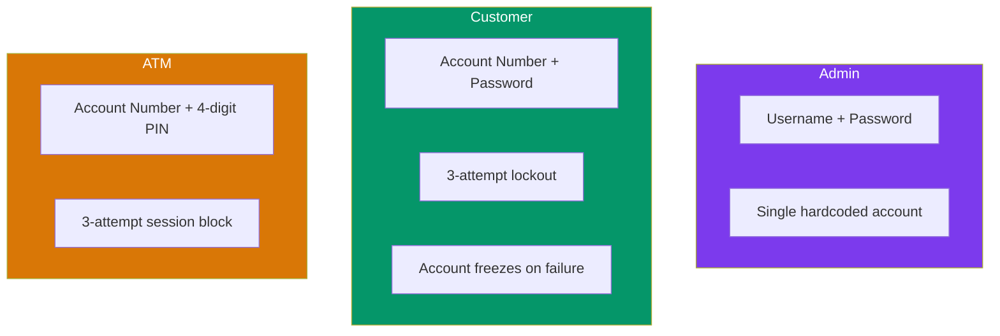

### 13.2 Security Features Summary

| Feature | Implementation |
|---|---|
| **Masked Password Input** | Characters replaced with `*` using `getch()` |
| **Masked PIN Input** | Only digits accepted, max 4 characters, displayed as `*` |
| **Login Attempt Limit** | 3 failed attempts → account locked (customer) or session blocked (ATM) |
| **Account Locking** | Locked accounts cannot login, deposit, withdraw, or transfer |
| **Admin Lock/Unlock** | Admin can manually lock or unlock any account |
| **Password Validation** | Enforces complexity: 8+ chars, uppercase, lowercase, digit, special |
| **PIN Validation** | Must be exactly 4 digits (1000–9999) |
| **Duplicate CNIC Prevention** | System rejects registration if CNIC already exists |
| **Self-Transfer Prevention** | Cannot transfer money to own account |
| **Input Sanitization** | `cin.fail()` handled with `cin.clear()` and `cin.ignore()` |

---

## 14. User Interface Guide

### 14.1 Main Menu

```
  +====================================================+
  |                                                    |
  |    $$$$$   $$      $$   $$$$$$                     |
  |    $$  $$  $$$    $$$  $$                          |
  |    $$$$$   $$ $$ $ $$   $$$$$                      |
  |    $$  $$  $$  $$  $$       $$                     |
  |    $$$$$   $$      $$  $$$$$$                      |
  |                                                    |
  |        BANK  MANAGEMENT  SYSTEM                    |
  |        Your Trusted Banking Partner                |
  |                                                    |
  +====================================================+

  2026-07-22 07:01:34

  ==================================================
               MAIN MENU
  ==================================================

  [1] Admin / Manager Login
  [2] Customer Section
  [3] ATM Section
  [0] Exit System

  Enter Your Choice:
```

### 14.2 Color Scheme

| Color Code | Color | Usage |
|---|---|---|
| 7 | White | Default text |
| 8 | Gray | Separators, timestamps, "Press any key" |
| 10 | Green | Success messages, balances |
| 11 | Cyan | Headers, logos, borders |
| 12 | Red | Error messages, Zakat deduction amount |
| 14 | Yellow | Menu options, warnings, Zakat notification |

### 14.3 Transaction Receipt

```
  +-----------------------------------------+
  |         TRANSACTION RECEIPT              |
  +-----------------------------------------+
  |                                         |
  |  Type         : Deposit                 |
  |  Account No.  : 1001                    |
  |  Amount       : PKR 50000.00            |
  |  New Balance  : PKR 3550000.00          |
  |  Date/Time    : 2026-07-22 07:01:34     |
  |                                         |
  +-----------------------------------------+
```

---

## 15. Compilation and Execution

### 15.1 Compile Command

```bash
g++ -o bms.exe main.cpp modules/utils.cpp modules/filehandling.cpp modules/admin.cpp modules/customer.cpp modules/atm.cpp
```

This command compiles all six `.cpp` source files together and links them into a single executable `bms.exe`.

### 15.2 Run Command

```bash
.\bms.exe
```

### 15.3 Compile with Warnings (Recommended for Development)

```bash
g++ -Wall -Wextra -o bms.exe main.cpp modules/utils.cpp modules/filehandling.cpp modules/admin.cpp modules/customer.cpp modules/atm.cpp
```

> [!IMPORTANT]
> You must recompile after every code change. The `.exe` file is not updated automatically    it reflects the code as it was at the time of the last compilation.

### 15.4 Clean and Rebuild

```bash
del bms.exe customers.txt transactions.txt
g++ -o bms.exe main.cpp modules/utils.cpp modules/filehandling.cpp modules/admin.cpp modules/customer.cpp modules/atm.cpp
.\bms.exe
```

---

## 16. Testing Plan

### 16.1 Test Cases    Admin Module

| # | Test Case | Input | Expected Result |
|---|---|---|---|
| 1 | Admin login with correct credentials | admin / Admin@123 | Login successful, dashboard shown |
| 2 | Admin login with wrong password | admin / wrong | Error message displayed |
| 3 | Add customer with valid data | All fields valid | Account created, number displayed |
| 4 | Add customer with duplicate CNIC | Existing CNIC | Error: already registered |
| 5 | Delete customer with confirmation | Y | Customer removed from file |
| 6 | Deposit into locked account | Locked account # | Error: account is locked |
| 7 | Transfer more than balance | Amount > balance | Error: insufficient balance |
| 8 | Transfer to same account | Same sender/receiver | Error: cannot self-transfer |

### 16.2 Test Cases    Customer Module

| # | Test Case | Input | Expected Result |
|---|---|---|---|
| 1 | Register with weak password | "abc" | Error: requirements not met |
| 2 | Register with valid password | "Ahmed@123" | Accepted |
| 3 | Login with wrong password 3 times | 3 wrong passwords | Account locked |
| 4 | Login to locked account | Valid credentials | Error: account locked |
| 5 | Check balance > 3M (first time) |    | Zakat deducted, notification shown |
| 6 | Check balance > 3M (second time) |    | No deduction (already deducted) |
| 7 | Withdraw more than balance | Amount > balance | Error: insufficient balance |

### 16.3 Test Cases    ATM Module

| # | Test Case | Input | Expected Result |
|---|---|---|---|
| 1 | Enter wrong PIN 3 times | 3 wrong PINs | Session blocked |
| 2 | Fast Cash with insufficient balance | PKR 10,000 (balance: 5,000) | Error: insufficient balance |
| 3 | Balance inquiry > 3M (first time) |    | Zakat deducted, notification shown |
| 4 | Mini statement with no transactions |    | Warning: no transactions found |
| 5 | Change PIN to same value | Same old/new PIN | Error: must be different |

### 16.4 Test Cases    Zakat Feature

| # | Test Case | Balance | Expected Result |
|---|---|---|---|
| 1 | Balance exactly 3,000,000 | 3,000,000 | No deduction (not greater than threshold) |
| 2 | Balance 3,000,001 | 3,000,001 | Zakat deducted: PKR 75,000.03 |
| 3 | Balance 3,500,000 (first check) | 3,500,000 | Zakat deducted: PKR 87,500.00 |
| 4 | Same account checked again | 3,412,500 | No deduction (already deducted once) |
| 5 | Balance 2,000,000 | 2,000,000 | No deduction (below threshold) |

---

## 17. Limitations and Future Enhancements

### 17.1 Current Limitations

| Limitation | Description |
|---|---|
| **Windows Only** | Uses `<windows.h>` and `<conio.h>`    not portable to Linux/macOS |
| **Flat File Storage** | No database; performance degrades with large data volumes |
| **No Encryption** | Passwords stored in plaintext in text files |
| **Single Admin** | Only one hardcoded admin account |
| **No Concurrent Access** | No file locking; single-user operation only |
| **Array Size Limits** | Fixed at 100 customers and 1000 transactions |
| **No Undo** | Deletions and transactions are permanent |

### 17.2 Potential Enhancements

| Enhancement | Description |
|---|---|
| Database Integration | Replace text files with SQLite or MySQL |
| Password Hashing | Store hashed passwords instead of plaintext |
| Multiple Admins | Dynamic admin accounts with role-based permissions |
| Cross-Platform | Replace Windows APIs with portable alternatives |
| Loan Management | Add loan issuance, EMI calculation, and tracking |
| Interest Calculation | Auto-calculate interest on savings accounts |
| Statement Export | Export transaction history to CSV or PDF |
| Search by Name | Add partial name matching to customer search |
| Dynamic Arrays | Replace fixed arrays with dynamic memory allocation |

---

## 18. Conclusion

The Bank Management System is a comprehensive C++ console application that demonstrates key programming fundamentals through a real-world banking simulation. The project successfully implements:

- **Modular design** with 7 header files and 6 implementation files, each with a clear single responsibility
- **Data persistence** using structured flat files with pipe-delimited formatting
- **Three distinct user interfaces** (Admin, Customer, ATM), each with dedicated authentication
- **Robust security** including masked input, login attempt limits, and account locking
- **Complete banking operations**    deposits, withdrawals, transfers with full transaction logging
- **Business logic**    automatic Zakat calculation and deduction with duplicate-prevention safeguards
- **Professional UI**    colored console output, ASCII art branding, animated loading, and formatted receipts

The codebase consists of approximately **2,800+ lines of C++** across 12 files, with thorough commenting and consistent coding conventions throughout. Every function follows a clear pattern: validate input, process logic, update files, and provide user feedback.

---

> **Document prepared for academic evaluation. All code is original and written in procedural C++ without the use of classes, adhering to Programming Fundamentals course requirements.**
